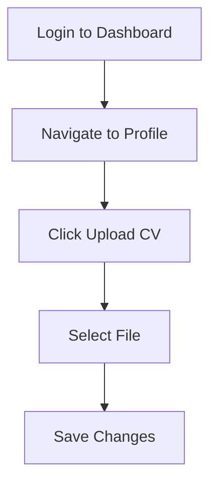

# Automated Job Application Robot

An intelligent and automated job search system that uses AI to scrape job listings, filter them according to your criteria, generate personalized cover letters, and send applications automatically.

## 🚀 Features

### Intelligent Scraping
- **Automatic scraping** of job listings on LinkedIn and other platforms
- **Accurate extraction** of job details: title, description, skills, company, location
- **Multi-page navigation** for comprehensive coverage of search results

### Filtering and AI Scoring
- **Custom filtering** based on your preferred criteria (job title, salary, location, etc.)
- **Relevance scoring** using AI to evaluate the match with your profile
- **Duplicate detection** to avoid repeated applications

### Automated Application Generation
- **Personalized cover letters** generated by AI based on the job and your profile
- **Automatic adaptation** to the style and requirements of each company
- **CV generation** optimized for each application

### Full Application Management
- **Automatic email sending** with attachments (CV, cover letter)
- **Application tracking** with status updates
- **Intelligent follow-up system** for unanswered applications

### Dashboard and Analytics
- **Streamlit web interface** to visualize your applications
- **Daily reports** by email with detailed statistics
- **Market analysis** to identify hiring trends

### Machine Learning
- **Model training** to improve matching accuracy
- **Predictive analysis** of application success chances
- **Continuous optimization** based on feedback

## 🛠️ Technologies Used

- **Python** - Main language
- **Playwright** - Automated web scraping
- **OpenAI GPT** - AI content generation
- **Supabase** - Database and authentication
- **Streamlit** - Web user interface
- **Scikit-learn** - Machine learning
- **PostgreSQL** - Relational database

## 📋 Prerequisites

- Python 3.8+
- Supabase account
- OpenAI API key
- Chromium browser (automatically installed with Playwright)

## 🚀 Getting Started

### 1. Clone the repository
```bash
git clone https://github.com/your-username/robot-job-application.git
cd robot-job-application
```

### 2. Create a virtual environment
```bash
python -m venv venv
source venv/bin/activate  # On Windows: venv\Scripts\activate
```

### 3. Install dependencies
```bash
pip install -r requirements.txt
playwright install
```

## 🔧 Configuration

Create a `.env` file at the project root with these environment variables:

```env
# Supabase (required)
SUPABASE_URL=your_supabase_url
SUPABASE_ANON_KEY=your_supabase_anon_key
SUPABASE_SERVICE_ROLE_KEY=your_supabase_service_role_key

# OpenAI (required)
OPENAI_API_KEY=your_openai_api_key

# Email (optional)
EMAIL_HOST=smtp.gmail.com
EMAIL_PORT=587
EMAIL_USER=your_email@gmail.com
EMAIL_PASSWORD=your_app_password

# Daily report (optional)
REPORT_RECIPIENT_EMAIL=your_email_for_reports@example.com
```

## 🔄 Daily Operation

To automate the daily scraping and application process, set up a scheduled task:

### Cron Job (Linux/macOS)
```bash
0 8 * * * cd /path/to/robot-job-application && /path/to/venv/bin/python orchestrator.py
```

### Scheduled Task (Windows)
1. Open Task Scheduler
2. Create new task:
   - Trigger: Daily at 8 AM
   - Action: Start a program
   - Program: `C:\path\to\venv\Scripts\python.exe`
   - Arguments: `orchestrator.py`
   - Start in: `C:\path\to\robot-job-application`

## 📊 Dashboard Usage

Run the dashboard with:
```bash
streamlit run dashboard.py
```

### Key Features
- **Applications Overview**: View all applications and their statuses
- **Statistics**: See success rates and application trends
- **User Profile Management**: Update your professional summary, skills, and job preferences
- **Configuration**: Adjust system settings

  <!-- User to add actual screenshot -->

### Updating Your CV via Dashboard
1. Navigate to "Profile" section
2. Click "Upload New CV"
3. Select your updated CV file (PDF or DOCX)
4. Click "Save" - system will use new CV for future applications

Example CV update flow:


## 🏗️ Project Architecture

```
robot-job-application/
├── orchestrator.py          # Main system coordination
├── scraper.py               # Job listing scraping
├── filter_jobs.py           # Job filtering based on criteria
├── ai_matcher.py            # Advanced AI matching
├── relevance_scorer.py      # Relevance scoring calculation
├── application_generator.py # Cover letter generation
├── application_bot.py       # Application automation
├── email_sender.py          # Email sending
├── follow_up_manager.py     # Follow-up management
├── dashboard.py             # Streamlit web interface
├── database.py              # Supabase connection and queries
├── market_analyzer.py       # Market analysis
├── ml_matcher_trainer.py    # ML model training
├── duplicate_detector.py    # Duplicate detection
├── migrate.py               # Database migration scripts
├── requirements.txt         # Python dependencies
└── README.md                # Documentation
```

## 🔧 Main Modules

### Orchestrator (`orchestrator.py`)
- Coordinates the entire application process
- Manages the daily workflow
- Generates detailed reports

### Scraper (`scraper.py`)
- Uses Playwright to navigate job sites
- Extracts structured job data
- Handles pagination and errors

### AI Matcher (`ai_matcher.py`)
- Uses language models for matching
- Compares user profiles with job descriptions
- Continuously improves accuracy

### Application Generator (`application_generator.py`)
- Generates personalized cover letters
- Adapts content to the company and position
- Uses optimized templates

## 🛠️ Troubleshooting

### Common Issues

**Scraper fails to load job listings**
- Ensure you have the latest version of Playwright: `playwright install`
- Check your network connection and that the job site is accessible

**Application emails not sending**
- Verify your email settings in the `.env` file
- Ensure the email service allows less secure apps (for Gmail, enable in account settings)

**AI-generated cover letter is poor quality**
- Check your OpenAI API key and quota
- Review your professional profile to ensure it has sufficient detail

**Dashboard not loading**
- Confirm Streamlit is installed: `pip install streamlit`
- Check for port conflicts (default port is 8501)

## 🔒 Security and Privacy

- **Secure storage** of sensitive data (API keys, passwords)
- **Encryption** of communications with Supabase
- **Permission management** for data access
- **Audit logging** of system actions

## 🤝 Contribution

Contributions are welcome! Here's how to contribute:

1. Fork the project
2. Create a feature branch (`git checkout -b feature/AmazingFeature`)
3. Commit your changes (`git commit -m 'Add some AmazingFeature'`)
4. Push to the branch (`git push origin feature/AmazingFeature`)
5. Open a Pull Request

### Development Guidelines
- Follow PEP 8 for code style
- Add tests for new features
- Document functions and classes
- Use descriptive commits

## 📝 License

This project is licensed under the MIT License - see the [LICENSE](LICENSE) file for details.

## 🐛 Reporting Bugs

If you find a bug, please open an issue on GitHub with:
- Detailed description of the problem
- Steps to reproduce
- Environment (OS, Python version)
- Error logs if available

## 💡 Future Features

- [ ] Multi-platform support (Indeed, Glassdoor, etc.)
- [ ] Mobile interface
- [ ] LinkedIn API integration
- [ ] Interview predictive analysis
- [ ] Personalized recommendations
- [ ] Collaborative mode for HR teams

## 📞 Support

For any questions or support:
- Open an issue on GitHub
- Contact the development team

---

**Note:** This system is designed to automate the application process but respects the terms of service of job platforms. Use it responsibly and ethically.
